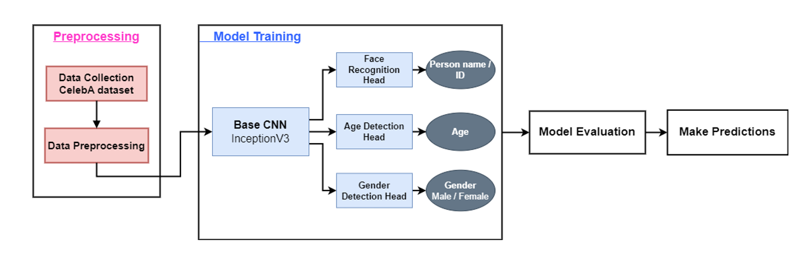

# Face Recognition & Analytics
"Multitask Face Recognition with Age and Gender Detection using Deep Learning"   
This project aims to build a multi-task learning model that can simultaneously perform face recognition, age estimation, and gender classification.

## Project Outline

## Dataset
Using selected features from [CelebA Dataset](https://www.kaggle.com/datasets/jessicali9530/celeba-dataset)  
CelebA dataset consists of triplets of images (anchor, positive, negative) used for faace recognition in addition to analytic features describing each image such as: gender, hair color, glasses, age, ...

### Data preprocessing
In the data preprocessing step, images are resized, matched to their triplets, and each anchor image is matched to its features that will be used in training which are age and gender.

## Model Architecture
The model consists of:
* Backbone convolutional neural network (CNN) used to extract images features (anchor, positive and negative). InceptionV3 pretrained model is used.
* Feed forward network head to detect anchor image age
* Feed forward network head to detect anchor image gender
* Cosine similarity head to detect similarity between anchor image and other images

### Model Training 
The backbone CNN weights are freezed except for the last few layers. The other heads are all tainable.

#### Loss function:
* For face recognition task -> cosine simillarity
* For gender and age -> Binary cross entropy loss

## Model Deployment
The Face Recognition App is deployed using a Flask backend to handle API requests and a React frontend for the user interface.
The deployment process involves setting up the backend and frontend environments, 
installing the necessary dependencies, and running the applications .

The Flask server manages the face recognition model and processes user inputs,
while the React app provides an interactive interface for users to upload images and receive results. 
Both components communicate through API calls to facilitate smooth functionality.

### Technologies Used

- **Frontend:**
  - **React**: A JavaScript library for building user interfaces.
  - **Axios**: For making HTTP requests from the frontend to the backend API.

- **Backend:**
  - **Flask**: A lightweight Python web framework for building the backend API.
  - **Pandas**: For data manipulation and analysis.
  - **scikit-learn**: For implementing machine learning models.
  - **OpenCV**: For image processing and face recognition tasks.

- **Deployment:**
  - **Git**: For version control and managing the project repository.
  - **GitHub**: For hosting the project repository.

- **Development Tools:**
  - **Visual Studio Code**: Code editor used for development.
  - **Postman**: For testing API endpoints.
  - **npm**: Package manager for JavaScript.

